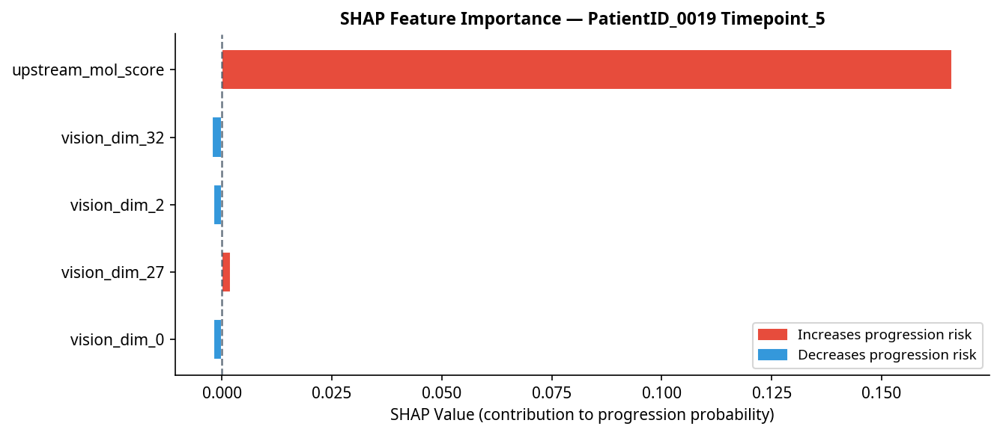

# Glioma Post-Treatment Surveillance Report
**Patient:** `PatientID_0019` | **Timepoint:** `Timepoint_5` | **Generated:** AI Agent Pipeline v1.0

---

## Section 1 — Fixed Clinical & Volumetric Metrics

### Patient Demographics & Timeline

| Field | Value |
| :--- | :--- |
| Patient ID | `PatientID_0019` |
| Current Timepoint | `Timepoint_5` (Timepoint #5) |
| Days from Diagnosis to MRI | 317 days |
| Ground Truth Label | No Progression (0) |

### Molecular Profile

*Note: Molecular profile values are sourced from `measurements.py` (currently being finalized). Placeholder values shown below — to be populated from EHR in production.*

| Biomarker | Status | Clinical Significance |
| :--- | :--- | :--- |
| IDH1 Mutation | Wild-type (0) | Associated with worse prognosis |
| MGMT Methylation | Unknown (4) | Affects pseudoprogression risk |
| EGFR Amplification | Amplified (2) | Aggressive phenotype marker |
| 1p/19q Codeletion | Intact (0) | Not oligodendroglial |
| TERT Promoter Mutation | Mutated (2) | Poor prognostic marker |
| WHO Grade | 4 | Highest malignancy grade |

### Longitudinal Risk Score Trajectory

*The table below shows the evolution of the LightGBM molecular risk score across all available timepoints. Delta values capture the rate of change — the clinically informative signal.*

| Timepoint | Days from Dx | Mol Score | Δ from Prior | Δ% from Prior | Δ from Nadir | Label |
| :--- | :---: | :---: | :---: | :---: | :---: | :---: |
| Timepoint_4 | 268 | 0.2151 | — | — | +0.0000 | Stable |
| Timepoint_5 ◀ **Current** | 317 | 0.3692 | +0.1541 | +71.6% | +0.1541 | Stable |
| Timepoint_6 | 379 | 0.5665 | +0.1973 | +53.5% | +0.3514 | **PD** |

---

## Section 2 — RANO 2.0 Rule Engine

| Criterion | Value | Threshold | Triggered? |
| :--- | :---: | :---: | :---: |
| Bidimensional (BD) Product Change | +71.6% | +25% | **YES** |
| New Independent Lesion | Detected | Any | **YES** |

> **RANO 2.0 Verdict:** **Progressive Disease (PD)**

---

## Section 3 — Confounder Check (Weighted Pseudoprogression Risk)

**Total Risk Score: 2.0 / 5.5**

> **Risk Classification: MODERATE Pseudoprogression Risk**

| Confounder Factor | Score Contribution | Rationale |
| :--- | :---: | :--- |
| Time Post Rt | +0.5 | (6–12 months post-RT — moderate risk, late pseudoprogression possible) |
| Mgmt | +1.5 | (MGMT methylated — pseudoprogression rate ~30-40%) |
| Steroid | +0.0 | (Steroid dose change +0% — within normal range) |
| Rc Adjacent | +0.0 | (No RC-adjacent enhancement) |

*Note: MGMT methylation status is the single strongest predictor of pseudoprogression risk. When MGMT status is unknown, risk should be treated conservatively.*

---

## Section 4 — AI Interpretation: Fusion MLP & SHAP Analysis

| Metric | Value |
| :--- | :--- |
| Unified Fusion Probability | **0.4306** |
| Alert Threshold | 0.48 |
| AI Verdict | 🟢 **LOW — NO ALERT** |
| RANO-AI Concordance | ⚠️ DISCORDANT — MDT REVIEW RECOMMENDED |

### SHAP Top Feature Contributions

*SHAP values explain the model's prediction, not direct causality. Features marked 'Novel Signal' should be interpreted with caution and cross-referenced with clinical findings.*

| Rank | Feature | SHAP Value | Direction | Clinical Status |
| :---: | :--- | :---: | :--- | :--- |
| 1 | `upstream_mol_score` | +0.1661 | ↑ Increases risk | Clinically Validated |
| 2 | `vision_dim_32` | -0.0022 | ↓ Decreases risk | Novel Signal |
| 3 | `vision_dim_2` | -0.0020 | ↓ Decreases risk | Novel Signal |
| 4 | `vision_dim_27` | +0.0020 | ↑ Increases risk | Novel Signal |
| 5 | `vision_dim_0` | -0.0019 | ↓ Decreases risk | Novel Signal |

---

## Section 5 — LLM-Generated Clinical Summary

> At 317 days from diagnosis, PatientID_0019 demonstrates a notable increase in the longitudinal LightGBM molecular score by 0.1541 from the prior timepoint, indicating a potential upward risk trajectory. The RANO 2.0 criteria classify the current imaging as progressive disease, citing a 71.6% increase in bidimensional measurements and the presence of a new lesion. In contrast, the AI fusion model yields a unified probability of 0.4306, below the alert threshold of 0.48, and thus does not support progression at this timepoint. This discordance may be partly explained by the AI’s reliance on the upstream molecular score as the primary driver toward progression (SHAP +0.1661), while novel imaging features (vision_dim_32 and vision_dim_2) exert minimal influence away from progression. The moderate pseudoprogression risk, influenced by MGMT methylation status and timing post-radiotherapy, further complicates interpretation. Given this clinical uncertainty and the conflicting assessments, a multidisciplinary team review is strongly recommended alongside short-interval follow-up imaging within 4 to 6 weeks to clarify disease status and guide management.

---

*This report was generated automatically by the Glioma Post-Treatment Surveillance AI Agent. It is intended as a decision-support tool and does not replace clinical judgment. All findings should be reviewed by a qualified neuro-oncologist.*