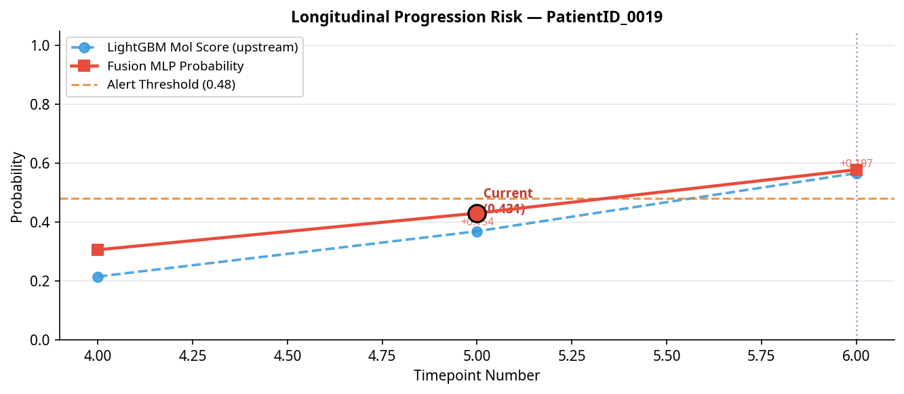
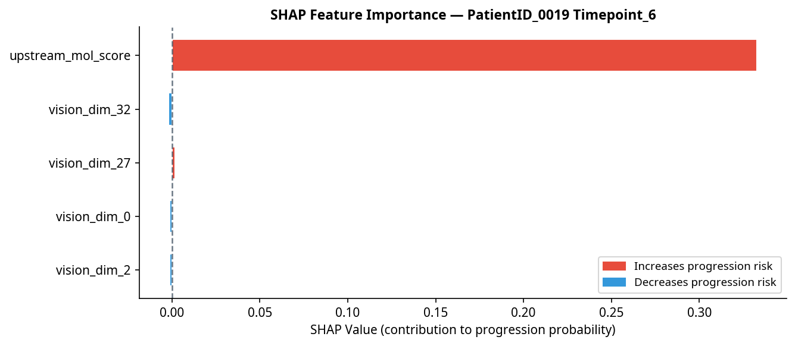

# Glioma Post-Treatment Surveillance Report
**Patient:** `PatientID_0019` | **Timepoint:** `Timepoint_6` | **Generated:** AI Agent Pipeline v1.0

---

## Section 1 — Fixed Clinical & Volumetric Metrics

### Patient Demographics & Timeline

| Field | Value |
| :--- | :--- |
| Patient ID | `PatientID_0019` |
| Current Timepoint | `Timepoint_6` (Timepoint #6) |
| Days from Diagnosis to MRI | 379 days |
| Ground Truth Label | **Progression (1)** |

### Molecular Profile

*Note: Molecular profile values are sourced from `measurements.py` (currently being finalized). Placeholder values shown below — to be populated from EHR in production.*

| Biomarker | Status | Clinical Significance |
| :--- | :--- | :--- |
| IDH1 Mutation | Wild-type (0) | Associated with worse prognosis |
| MGMT Methylation | Unknown (4) | Affects pseudoprogression risk |
| EGFR Amplification | Amplified (2) | Aggressive phenotype marker |
| 1p/19q Codeletion | Intact (0) | Not oligodendroglial |
| TERT Promoter Mutation | Mutated (2) | Poor prognostic marker |
| WHO Grade | 4 | Highest malignancy grade |

### Longitudinal Risk Score Trajectory

*The table below shows the evolution of the LightGBM molecular risk score across all available timepoints. Delta values capture the rate of change — the clinically informative signal.*

| Timepoint | Days from Dx | Mol Score | Δ from Prior | Δ% from Prior | Δ from Nadir | Label |
| :--- | :---: | :---: | :---: | :---: | :---: | :---: |
| Timepoint_4 | 268 | 0.2151 | — | — | +0.0000 | Stable |
| Timepoint_5 | 317 | 0.3692 | +0.1541 | +71.6% | +0.1541 | Stable |
| Timepoint_6 ◀ **Current** | 379 | 0.5665 | +0.1973 | +53.5% | +0.3514 | **PD** |

---

## Section 2 — RANO 2.0 Rule Engine

| Criterion | Value | Threshold | Triggered? |
| :--- | :---: | :---: | :---: |
| Bidimensional (BD) Product Change | +53.5% | +25% | **YES** |
| New Independent Lesion | Detected | Any | **YES** |

> **RANO 2.0 Verdict:** **Progressive Disease (PD)**

---

## Section 3 — Confounder Check (Weighted Pseudoprogression Risk)

**Total Risk Score: 0.0 / 5.5**

> **Risk Classification: LOW Pseudoprogression Risk**

| Confounder Factor | Score Contribution | Rationale |
| :--- | :---: | :--- |
| Time Post Rt | +0.0 | (> 12 months post-RT — pseudoprogression less likely but not excluded) |
| Mgmt | N/A | (MGMT status not provided) |
| Steroid | +0.0 | (Steroid dose change +0% — within normal range) |
| Rc Adjacent | +0.0 | (No RC-adjacent enhancement) |

*Note: MGMT methylation status is the single strongest predictor of pseudoprogression risk. When MGMT status is unknown, risk should be treated conservatively.*

---

## Section 4 — AI Interpretation: Fusion MLP & SHAP Analysis

| Metric | Value |
| :--- | :--- |
| Unified Fusion Probability | **0.5782** |
| Alert Threshold | 0.48 |
| AI Verdict | 🟠 **MODERATE — CLOSE FOLLOW-UP WARRANTED** |
| RANO-AI Concordance | ✅ CONCORDANT |

### SHAP Top Feature Contributions

*SHAP values explain the model's prediction, not direct causality. Features marked 'Novel Signal' should be interpreted with caution and cross-referenced with clinical findings.*

| Rank | Feature | SHAP Value | Direction | Clinical Status |
| :---: | :--- | :---: | :--- | :--- |
| 1 | `upstream_mol_score` | +0.3329 | ↑ Increases risk | Clinically Validated |
| 2 | `vision_dim_32` | -0.0018 | ↓ Decreases risk | Novel Signal |
| 3 | `vision_dim_27` | +0.0016 | ↑ Increases risk | Novel Signal |
| 4 | `vision_dim_0` | -0.0014 | ↓ Decreases risk | Novel Signal |
| 5 | `vision_dim_2` | -0.0014 | ↓ Decreases risk | Novel Signal |

---

## Section 5 — LLM-Generated Clinical Summary

> At 379 days post-diagnosis, PatientID_0019 demonstrates a significant longitudinal increase in molecular risk score, with a delta of +0.1973 from the prior timepoint and +0.3514 from the nadir, indicating a notable upward trajectory. The RANO 2.0 assessment confirms progressive disease, evidenced by a 53.5% increase in bidimensional measurements and the appearance of a new lesion. Concordantly, the AI fusion model issues a progression alert with a unified fusion probability of 0.5782, which is above the predefined threshold yet within a moderate range, consistent with progression but warranting close follow-up. The low pseudoprogression risk score, given the time elapsed since radiotherapy and stable steroid dosing, reduces the likelihood of treatment-related imaging changes confounding interpretation. The AI’s conclusion is primarily driven by the upstream molecular score (SHAP=+0.3329), a clinically validated feature strongly favoring progression, supplemented by minor contributions from novel imaging-derived signals. Given the concordance between RANO criteria and AI assessment, the findings support a diagnosis of true progression. It is recommended that the patient undergo multidisciplinary team review with consideration for short-interval MRI to closely monitor disease evolution and guide timely therapeutic decisions.

---

*This report was generated automatically by the Glioma Post-Treatment Surveillance AI Agent. It is intended as a decision-support tool and does not replace clinical judgment. All findings should be reviewed by a qualified neuro-oncologist.*